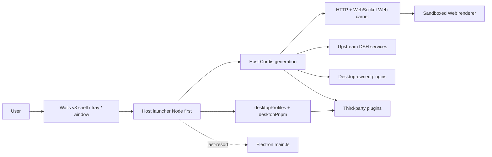

# DSH Desktop Architecture

## Overview

DSH Desktop's current primary path is a **hybrid architecture**: the Go 1.27 + Wails v3 native shell (`dsh-plugin-desktop/wails/`) owns window, tray, menu, and dialogs; a **Node-first Cordis Host** (`host-main.ts` / `NodeDesktopRuntime`, no app.whenReady) runs as the sidecar. The Host exposes the ordinary Web UI over an HTTP/WebSocket Web carrier. The carrier listens on loopback by default and can be exposed to the LAN only after the user explicitly acknowledges the risk. Desktop does not create a second renderer IPC plugin system and does not expose raw native APIs to the page.

Recommended entry: `start:wails` / `dev:wails` / `smoke:wails` / `start:host`. Electron BrowserWindow / Tray / main.ts is **not** the primary product path, but remains as last-resort fallback (explicit allow; see `dsh-plugin-desktop/docs/electron-shell-fallback.md`). Until the release flip, electron-builder remains the default product CI packaging path.

Canonical migration maps: `docs/wails-migration.md`, `dsh-plugin-desktop/src/wails-shell-bridge.md`, `docs/wails-node-host-boot.md`.

## Startup order (Wails + Node Host primary path)

1. The Wails shell starts and launches the Cordis Host sidecar (Node host-main first; Electron-as-Node when ABI natives require it; LAST-RESORT Electron main.ts only with explicit allow).
2. The Host launcher reads Desktop-owned profile/mode state and prepares the active profile without modifying profiles merely to list them.
3. The launcher provides the native runtime, generation profile bootstrap, and bundled package-manager environment (Node Host path).
4. The Host Cordis root mounts Loader entries. Desktop services are registered before third-party entries can consume them.
5. `dsh-base`, `dsh-web-app`, and the selected profile's third-party bundles compose the Web carrier.
6. The Host binds loopback by default or all interfaces when confirmed; it announces ready URL + AuthProxy, and the Wails ShellService loads the same-origin page.
7. Tray and Aux windows are owned by Wails; the profile is committed as last-known-good after the Web surface loads.

Every profile or mode switch disposes the current generation before starting the next one. Service references, window objects, and subprocess handles must not be cached across generations.

## Host, Client, and native runtime

- **Upstream Host** owns agent, model, tool, session, settings, webServer, and subprocess capabilities.
- **Desktop Host** owns the window, tray, profiles, terminal, updates, and the two public Desktop services.
- **Web Client** contains the official Web UI and third-party browser contributions. It works over the shared Web carrier and does not call native shell APIs directly.
- **Native runtime** adapts the Wails shell (primary) or Electron window/tray (last-resort), filesystem/network operations, and installers. `desktopRuntime` is for Desktop-owned rows only.

Compatibility mode validates its environment and adds only an independent 36-pixel Desktop frame through the overlay slot; the official layout, root, sidebar, and conversation remain an unrelated content viewport below it. Extended mode disables the official root layout and installs its own Desktop layout/sidebar registration, which continues to host the official sidebar, conversation, and details occupants inside an inverted-L material frame. Enhanced mode keeps a separate root registration and its original compact internal-caption geometry. macOS and Windows apply capability-gated native materials without changing the ownership of upstream occupant slots.

Desktop-level confirmations, warnings, errors, and results do not enter the Web Client tree. `DesktopDialogWindow` creates a separate sandboxed modal `BrowserWindow`, applies the shared empty utility frame, parents it to the active generation window when possible, and accepts only one bounded local response. Recovery and Profile creation are separate Desktop-owned windows using the same title-free frame. Recovery itself is a shadcn page with reason-first presentation and four workflow tabs; destructive recovery actions delegate their confirmation back to `DesktopDialogWindow`.

### Native shell generation and platform adapters (Electron last-resort path)

`ElectronRuntime` coordinates the Host and native desktop environment without directly owning window and tray details. Each start creates one `ElectronShellGeneration` module that completely owns its `BrowserWindow`, `Tray`, related Electron listeners, navigation restrictions, external-link handling, and zoom shortcuts. A generation must be disposed through its idempotent `release()` interface; callers must not cache or destroy those resources separately across generations.

Platform differences live at the `ElectronPlatformStrategy` seam selected once during startup. The Windows, macOS, and Linux adapters declare directory-picking, shell-mode, and update-download capabilities and own their platform-specific menu, Dock icon, and native-material operations. New platform branches belong in the corresponding adapter; the generation and runtime retain only the lifecycle shared across platforms.

## Profile and service boundaries

The profile name and absolute directory come from `desktopProfiles.current`; they must not be inferred from argv, settings, or a URL. `list()` is read-only discovery. `select()` records a pending target and completes the switch through restart.

`desktopPnpm.run()` runs bundled pnpm directly. `runPlugin()` uses packaged DSH CLI semantics so profile initialization, relative sources, and bundle reconciliation remain authoritative. Both operations belong to the current generation and use the subprocess service for complete process-tree ownership.

The launcher-private `desktopRuntime`, `desktopPnpmBootstrap`, Electron executable, Node helpers, and ABI environment are not third-party APIs. The stable package exposes `dsh-plugin-desktop/profile-service` and `dsh-plugin-desktop/pnpm`; the Beta package exposes the corresponding `dsh-plugin-desktop-beta/*` paths.

## Packaging and runtime closure

Product CI still defaults to Electron Builder and `app.asar` (Wails package/AppImage paths evolve in parallel; electron-builder remains authoritative until the release flip), while dependencies that must be physical (for example pnpm, node-pty, and Windows ACL/native files) live under `app.asar.unpacked`. The packaged-runtime gate checks both archive entries and physical runtime entries; profile fallback links must not target virtual ASAR paths that Node cannot resolve.

The outer workspace uses Yarn. The pinned `deepseek-harness/` submodule keeps its own pnpm workspace. Stable and Beta Desktop sources live in `dsh-plugin-desktop/` and `dsh-plugin-desktop-beta/`, with a variant-alignment gate protecting shared behavior; neither package edits the upstream submodule.

## Release-channel protocol

Stable and Beta are separate physical npm packages and system applications; Git branches do not define the channels. Stable uses `dsh-plugin-desktop`, `DSH Desktop`, and `ai.deepseek.dsh.desktop`; Beta uses `dsh-plugin-desktop-beta`, `DSH Desktop Beta`, and `ai.deepseek.dsh.desktop.beta`. `upstream.json` records both channels' upstream versions, commits, and vendored-runtime manifests. Exact root resolutions ensure that each workspace resolves only its own DSH runtime.

Version checks and installer downloads send `X-DSH-Desktop-Channel: stable|beta`. A check also sends the current version, while a download sends `X-DSH-Desktop-Target-Version`; the service must echo the requested channel and version. Legacy clients without the channel header are treated as stable. A Beta client requires an explicit `channel: "beta"` response. Stable accepts only release SemVer, while Beta accepts only `-beta.N`. Automatic Beta updates query only Beta. **Install Stable Edition** is a separate explicit operation that may select a lower version and installs Stable alongside Beta.

The service must implement these selection and echo rules, with complete platform artifacts for both channels, before a Beta release becomes discoverable. Otherwise the client treats the response as invalid and will not silently cross channels.

## Maintainer reading

- [Desktop service contract](../dsh-plugin-desktop/docs/plugin-services.md)
- [Package README](../dsh-plugin-desktop/README.md)
- [Pinned upstream and isolated Yarn workspace](../.agents/notes/implemented/process/2026-08-15-pinned-upstream-and-isolated-yarn-workspace.md)
- [Profile and pnpm services decision](../.agents/notes/implemented/architecture/2026-08-15-desktop-profile-and-pnpm-services.md)
- [Advanced shell decision](../.agents/notes/implemented/architecture/2026-08-15-desktop-advanced-shell.md)
- [Native shell generation and platform adapters](../.agents/notes/implemented/architecture/2026-08-19-native-shell-generation-and-platform-adapters.md)
- [Wails migration](wails-migration.md)
- [Wails workspace scripts](wails-workspace-scripts.md)
- [Node-first Host boot](wails-node-host-boot.md)
- [Electron shell fallback](../dsh-plugin-desktop/docs/electron-shell-fallback.md)
- [Wails shell bridge map](../dsh-plugin-desktop/src/wails-shell-bridge.md)
