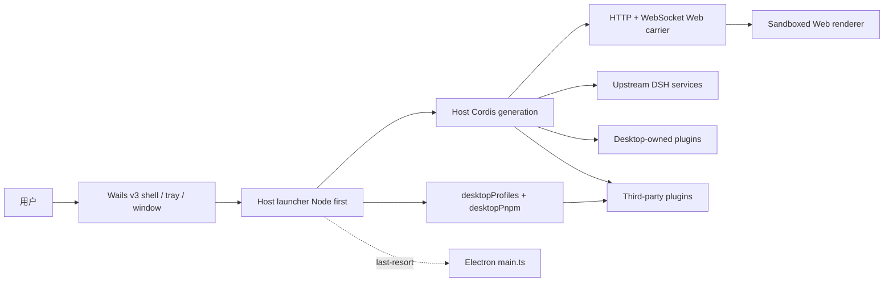

# DSH Desktop 架构

## 总览

DSH Desktop 当前主路径是 **混合架构**：Go 1.27 + Wails v3 原生壳（`dsh-plugin-desktop/wails/`）负责窗口、托盘、菜单与对话框；**Node-first Cordis Host**（`host-main.ts` / `NodeDesktopRuntime`，无 `app.whenReady`）作为 sidecar 提供官方 DSH Host。Host 通过 HTTP/WebSocket Web carrier 提供普通 Web UI；carrier 默认只监听回环地址，也可在用户明确确认风险后向局域网开放。Desktop 没有另造一条 renderer IPC 插件系统，也不把原生 API 直接暴露给页面。

推荐入口：`start:wails` / `dev:wails` / `smoke:wails` / `start:host`。Electron `BrowserWindow` / Tray / `main.ts` **不是**当前主产品路径，但仍保留为最后手段 fallback（需显式允许；见 `dsh-plugin-desktop/docs/electron-shell-fallback.md`）。在发布切换完成前，electron-builder 仍是默认产品 CI 打包路径。

权威迁移与桥接说明：`docs/wails-migration.md`、`dsh-plugin-desktop/src/wails-shell-bridge.md`、`docs/wails-node-host-boot.md`。

## 启动顺序（Wails + Node Host 主路径）

1. Wails 壳启动并拉起 Cordis Host sidecar（优先 Node host-main；需要时 Electron-as-Node；显式允许时 LAST-RESORT Electron main.ts）。
2. Host launcher 读取 Desktop 私有 profile/mode，准备激活 profile（列举不会改写用户 profile）。
3. Launcher provides native runtime bootstrap for the Node Host generation.
4. Host Cordis root 启动 Loader entries。Desktop service 在第三方插件可读取前注册。
5. 官方 `dsh-base`、`dsh-web-app` 和 profile 中的第三方 bundle 组成 Web carrier。
6. Host binds loopback or confirmed LAN, announces ready URL, Wails loads same-origin page.
7. Tray and Aux windows are owned by Wails; commit last-known-good after Web surface is ready.

任何 profile 或模式切换都会 dispose 当前 generation，再启动新的 generation。Service reference、窗口对象和 subprocess handle 都不能跨 generation 缓存。

## Host、Client 和 native runtime

- **Upstream Host**：agent、model、tool、session、settings、webServer 和 subprocess 等官方能力。
- **Desktop Host**：窗口、托盘、profile、终端、更新，以及对第三方开放的两个 service。
- **Web Client**：官方 Web UI 和第三方浏览器界面。它通过共享 Web carrier 工作，不直接调用原生 shell API。
- **Native runtime**：主路径为 Wails 窗口/托盘/对话框；Electron 适配器保留为最后手段。`desktopRuntime` 只供 Desktop 自有 row 使用。

兼容模式的 Client face 会校验环境，并且只通过 overlay slot 加入一条独立的 36 像素 Desktop frame；官方 layout、root、sidebar 与 conversation 作为完全无关的内容 viewport 从它下方开始。扩展窗口会禁用官方 root layout，安装自己独立注册的 Desktop layout/sidebar surface，并在倒 L 材质 frame 中继续承载官方 sidebar、conversation 与 details occupant。增强模式保留独立 root registration 与最初的紧凑内部 caption 几何。macOS 与 Windows 会按系统能力使用原生材质，同时不改变上游 occupant slot 的所有权。

Desktop 级确认、警告、错误与结果不会进入 Web Client 组件树。`DesktopDialogWindow` 会创建独立、沙箱化的模态 `BrowserWindow`，应用共享的空白 utility frame，并在可能时以当前 generation 窗口为 parent，只接受一次有界本地结果。恢复模式与新增 Profile 是使用同一套无标题 frame 的独立 Desktop-owned 窗口。恢复页面本身使用 shadcn，先展示原因，再提供四个工作流 Tab；破坏性恢复操作会把确认交回 `DesktopDialogWindow`。

### 原生 Shell generation 与平台 adapter（Electron 最后手段路径）

`ElectronRuntime` 负责协调 Host 与原生桌面环境，但不直接拥有窗口和托盘的细节。每次启动由一个 `ElectronShellGeneration` module 完整拥有 `BrowserWindow`、`Tray`、相关 Electron listener、导航限制、外链处理和缩放快捷键。释放 generation 必须通过其幂等 `release()` interface 完成，调用方不能跨 generation 缓存或单独销毁这些资源。

平台差异集中在启动时选择一次的 `ElectronPlatformStrategy` seam。Windows、macOS 与 Linux adapter 声明目录选择、Shell 模式切换和更新下载能力，并负责各自的菜单、Dock 图标与原生材质操作。新的平台分支应进入对应 adapter；generation 与 runtime 中只保留各平台共享的生命周期流程。

## Profile 与服务边界

profile 的名字和绝对目录由 `desktopProfiles.current` 提供，不能从 argv、settings 或 URL 猜测。`list()` 是只读发现；`select()` 记录 pending target，并通过重启完成切换。

`desktopPnpm.run()` 直接跑内置 pnpm；`runPlugin()` 通过打包的 DSH CLI 维持 profile 初始化、相对 source 和 bundle reconcile。两者都属于当前 generation，并由 subprocess service 管理完整进程树。

Launcher 私有的 `desktopRuntime`、`desktopPnpmBootstrap`、Electron executable、Node helper 和 ABI 环境不是第三方 API。稳定包的公开 contract 是 `dsh-plugin-desktop/profile-service` 与 `dsh-plugin-desktop/pnpm`；Beta 包提供对应的 `dsh-plugin-desktop-beta/*` 路径。

## 打包与运行时闭包

当前产品 CI 默认仍使用 Electron Builder 和 `app.asar`（Wails `package:wails` / AppImage 路径并行演进；发布切换前以 electron-builder 为准），但需要物理 unpack 的依赖（例如 pnpm、node-pty、Windows ACL/native 文件）会放在 `app.asar.unpacked`。Packaged runtime gate 会检查 ASAR 入口和物理运行时入口，profile fallback 不能把符号链接指向无法被 Node 解析的虚拟 ASAR 路径。

根 workspace 使用 Yarn；固定的 `deepseek-harness/` 子模块保持上游自己的 pnpm workspace。稳定版与 Beta 的桌面代码分别位于 `dsh-plugin-desktop/` 和 `dsh-plugin-desktop-beta/`，共享功能由变体同步检查约束；两者都不修改上游子模块。

## 发行通道协议

稳定版与 Beta 是两个实体 npm 包和两个系统应用，不由 Git 分支区分。稳定版使用 `dsh-plugin-desktop`、`DSH Desktop` 与 `ai.deepseek.dsh.desktop`；Beta 使用 `dsh-plugin-desktop-beta`、`DSH Desktop Beta` 与 `ai.deepseek.dsh.desktop.beta`。`upstream.json` 同时记录两个通道的上游版本、提交和 vendored runtime 清单，根级精确 resolution 保证每个 workspace 只能解析自己的 DSH 运行时。

版本检查和安装包下载均携带 `X-DSH-Desktop-Channel: stable|beta`。检查请求还携带当前版本；下载请求携带 `X-DSH-Desktop-Target-Version`，服务端必须返回与请求一致的通道与版本。没有通道 header 的旧客户端按稳定版处理；Beta 客户端则必须收到明确的 `channel: "beta"` 响应。稳定通道只接受正式 SemVer，Beta 通道只接受 `-beta.N`。Beta 自动更新只查询 Beta；“安装稳定版”是独立的显式操作，允许选择较低版本并将稳定版安装在 Beta 旁边。

服务端必须在 Beta 发布前先支持上述选择与回显规则，并为两个通道分别准备完整的平台产物。否则客户端会把响应视为无效，不会静默跨通道下载。

## 维护者深入阅读

- [Desktop service contract](../dsh-plugin-desktop/docs/plugin-services.md)
- [Package README](../dsh-plugin-desktop/README.md)
- [Pinned upstream and isolated Yarn workspace](../.agents/notes/implemented/process/2026-08-15-pinned-upstream-and-isolated-yarn-workspace.md)
- [Profile and pnpm services decision](../.agents/notes/implemented/architecture/2026-08-15-desktop-profile-and-pnpm-services.md)
- [Advanced shell decision](../.agents/notes/implemented/architecture/2026-08-15-desktop-advanced-shell.md)
- [Native shell generation and platform adapters](../.agents/notes/implemented/architecture/2026-08-19-native-shell-generation-and-platform-adapters.md)
- [Wails migration](wails-migration.md)
- [Wails workspace scripts](wails-workspace-scripts.md)
- [Node-first Host boot](wails-node-host-boot.md)
- [Electron shell fallback](../dsh-plugin-desktop/docs/electron-shell-fallback.md)
- [Wails shell bridge map](../dsh-plugin-desktop/src/wails-shell-bridge.md)
